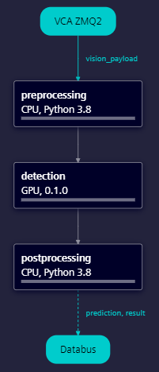

<!--
SPDX-FileCopyrightText: Copyright (C) Siemens AG 2021. All Rights Reserved.

SPDX-License-Identifier: MIT
-->

# AI SDK Object Detection Tutorial

This is an AI SDK tutorial intended to create an object detection pipeline running on AI Inference Server with GPU extension.
The project example is designed to explain the workflow of creating a Pipeline with GPURuntimeComponent through the guidance of the interactive IPython Notebooks in the `notebook` folder.

The main goal of the example is introducing the capabilities of a GPURuntimeComponent, which allows you to run an ONNX model on GPU.
_Important!_ As the AI Inference Server, the AI SDK supports exclusively ONNX models to run on GPURuntime step.

The example demonstrates the stages of deploying an ONNX model to an AI Inference Server with GPU support, such as

- Creating test set for the workflow
- Studying and fixing the ONNX model format
- Creating Pre- and Postprocessing steps to support the GPURuntimeComponent
- Packaging the model into an Edge Configuration Package
- Testing the Edge Configuration Package in local Python environment

By the end of the tutorial the Pipeline below is created:



_Hint: This readme is available both as HTML and Markdown. The HTML version you can use with any browser, even if you have no software with Markdown rendering capabilities installed. We recommend using the Markdown version if you have a notebook editor, as most of these let you navigate the links to the notebooks of the template directly._

# Setup environment for running the notebooks

We assume that Jupyter Lab or another notebook editor is already installed on your machine.

We recommend that you run the notebooks using the `object_detection` ipython kernel from the `object_detection` Python environment.

The following commands show how to set up such an environment on Linux.
If you are using Windows, please find the minor differences in the comments.

You can choose your preferred Python environment manager to create the separated Python environment.
We show example for `venv`.

```bash
# via venv assuming Python 3.11.10 is installed on path {PYTHON_HOME_3.11.10}
{PYTHON_HOME_3.11.10}/bin/python -m venv {ENV_DIR}/object_detection
{ENV_DIR}/object_detection/bin/activate  # on Windows, 'activate.bat' can be found in folder 'Scripts' instead of 'bin'

```

Once the environment is created and activated you need to install required packages including AI SDK and ipykernel.
These packages must be installed at the same time for pip's dependency resolution to work correctly.
_Note:_ `$DOWNLOAD_PATH` is the _directory path containing simaticai sdk wheel_, which can be set in environment variables or replaced in the command below.

Finally, register an ipykernel for running the notebooks.

```bash
pip install ipykernel -r requirements.txt -f $DOWNLOAD_PATH

python -m ipykernel install --user --name object_detection --display-name "(Python) Object Detection"
```

# Execute the notebooks to package your model

Now the notebooks can be explored and executed in your notebook editor.
Please make sure that you select the `object_detection` kernel to execute the AI SDK Object Detection notebooks.

### 1. Creating test set for the workflow

The notebook [01-CreateTestSet.ipynb](./notebooks/01-CreateTestSet.ipynb) explains the use case in a nutshell and generates artificial images in jpg format in order to have a test set for the rest of the tutorial. By the end of the execution of the notebook you will have an **artificial test set** for the further steps.

### 2. Analyzing and fixing the model ONNX format

The notebook [10-ObjectDetectionModel.ipynb](./notebooks/10-ObjectDetectionModel.ipynb) explains the used model, the possible mistakes in the ONNX definition and how to correct them. By the end of the execution of the notebook you will have an **well prepared onnx model** to package.

### 3. Creating Pre- and Postprocessing steps to support the GPURuntimeComponent

The notebook [20-PreAndPostProcessing.ipynb](./notebooks/20-PreAndPostProcessing.ipynb) explains the expected inputs and produced outputs of a GPURuntimeComponent, and then helps to understand how to define a Pre- and Postprocessing PythonComponent for creating and processing them. By the end of the execution of the notebook you will have **two Python scripts** implementing the job of **Pre- and Postprocessing steps**.

### 4. Packaging the model into an Edge Configuration Package

The notebook [30-CreatePipeline.ipynb](./notebooks/30-CreatePipeline.ipynb) explains how to create the steps and the pipeline itself. By the end of the execution of the notebook you will have a **Pipeline Deployment Package**.

### 5. Testing the Edge Configuration Package in local Python environment

The notebook [40-TestPipelineLocally.ipynb](./notebooks/40-TestPipelineLocally.ipynb) explain how to test the created pipeline and how to detect possible mistakes in it. By the end of the execution of the notebook you will have the _Pipeline Deployment Package_ **tested**.

# Directory structure

The directory structure is based on [Cookiecutter Data Science](https://drivendata.github.io/cookiecutter-data-science/).

```text
├── README.md          <- The top-level README for developers using this project.
├── data
│   ├── processed      <- Artificial images for testing purposes.
│   └── raw            <- The original, immutable data dump.
│
├── docs               <- A default Sphinx project; see sphinx-doc.org for details.
│
├── models             <- Trained and serialized models, model predictions, or model summaries
│
├── notebooks          <- Jupyter notebooks. The naming convention is a number (for ordering),
│                         the creator's initials, and a short `-` delimited description.
│
├── packages           <- This is where the edge config package is created.
│                         The folder also contains the PythonPackages.zip which collects the wheel
│                         files that are officially not available in the proper format to deploy
│
├── reports            <- Analysis generated as HTML, PDF, LaTeX, etc.
│   └── figures        <- Graphics and figures generated for use in `reports`.
│
├── src                <- Source code for use in this project.
│   │
│   └── preprocessing  <- Required resources for preprocessing  PythonComponent
│   └── detection      <- Required resources for detection GPURuntimeComponent
│   └── postprocessing <- Required resources for postprocessing PythonComponent
│
├── test               <- This is where the local pipeline runner creates the local test environment.
│
├── CHANGELOG.md       <- The top-level CHANGELOG for developers using this project.
├── requirements.txt   <- The list of required Python packages to execute the notebooks.
```
