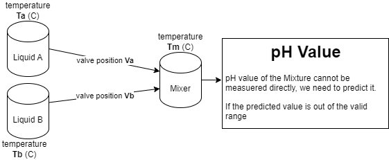

<!-- Copyright (C) Siemens AG 2021. All Rights Reserved. -->

# AI SDK Soft Sensor e2e tutorial

This is a machine learning project intended to create a pipeline with a Soft Sensor running on AI Inference Server.  
The project example is designed to be extracted into a folder and the example notebooks executed in an interactive Python notebook editor such as Jupyter lab or Visual Studio Code.

## Use case

The diagram below represents a producing workflow of a liquid mixture, which has two components, `liquid A` and `liquid B`, with given temperatures and dosing rates, `temparature A/B` and `valve position A/B`.  
These have effect on the final feature of the mixture, let's assume this is the `pH value` of the liquid C.

We can measure the temperatures and velocities, but cannot measure the pH value directly.

Our real sensors provides the data on PROFINET IO, in every minute, 60 data points per minute on every tag.

We are building a Linear Regression model to predict the final pH value of the mixture C, and then calculate the required changes of velocity A and B.

## How to create the Pipeline

The example demonstrates the three stages of deploying a model to AI Inference Server, such as

- Creating a model embedded
  - Notebook [10-CreateRegressionModel](./notebooks/10-CreateRegressionModel.ipynb)
- Implementing inference wrapper for the model
  - Notebook [20-CreateInferenceWrapper](./notebooks/20-CreateInferenceWrapper.ipynb)
- Packaging the model into an Edge Configuration Package
  - Notebook [30-CreatePipelinePackage](./notebooks/30-CreatePipelinePackage.ipynb)
- Testing the Edge Configuration Package in local Python environment
  - Notebook [40-TestPipelineLocally](./notebooks/40-TestPipelineLocally.ipynb)

