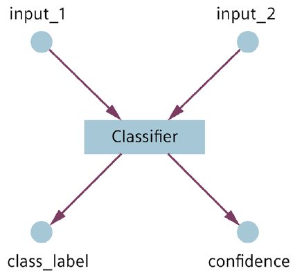

<!--
SPDX-FileCopyrightText: Copyright (C) 2020 - 2025 Siemens AG

SPDX-License-Identifier: MIT
-->

# How to define PythonComponents

In this context, 'component' in general, and `PythonComponent` in particular refers to a pipeline step that consumes input data, processes that data by using a model, and produces the output data, all while running on CPU on AI Inference Server.\
The model can mean, in a narrower sense, an ML model such as a neural network or the random forest algorithm, or simply an aggregator or other pre- or postprocessing logic.\
In every case, a Python script, hereinafter referred to as the `entrypoint`, establishes the connection between the model and the AI Inference Server. The server needs to receive information about what Python environment is required to execute the code, including the required Python packages or file resources.

## Essential information for the execution of the code

The most essential information for the execution of the code is:

- The Python version required to run the Python script
- The Python script that receives the input data
- The input and output variables of the component

### Create a component with a specific Python version

The below example creates a component for a pipeline step to be executed on CPU, and defines its basic properties.

```python
from simaticai import deployment
# defines basic properties of the pipeline step
component = deployment.PythonComponent(name='classifier', version='1.0.0', python_version='3.11')
```

> Note\
> AI Inference Server supports two versions of Python (3.10 and 3.11). AI SDK can create components for those two target Python environments.

### Defining the entrypoint

The `entrypoint` is the Python code that establishes the connection between the model and the AI Inference Server. Without that the model will not be able to receive data from AI Inference Server.
To define the `entrypoint`, you can use the `add_resources()` and `set_entrypoint()` method.

With the use of `add_resources()` you can add custom Python code to your PythonComponent, while the `set_entrypoint()` allows you to define which Python script will be used as an entrypoint and thus be responsible for receiving data from AI Inference Server.

See example below

```python
# adding the .py file that contains the Python script for the entrypoint
component.add_resources("../src/", "entrypoint.py")

# tying  the entrypoint to a specific Python script
component.set_entrypoint('entrypoint.py')
```

See further details in [02-create-entrypoint.md](02-create-entrypoint.md).

### Defining Inputs and Outputs for the component

While entrypoint is responsible for receiving the inputs and handling outputs of pipeline level, each component could have its own inputs and outputs. These inputs and outputs must be made available either by the `entrypoint` or by a preceeding component.

There are dedicated functions defined in AI SDK to add inputs and outputs to a component. These are `add_input()` and `add_output()`.

See their example usage below:

```python
# defining input variable of component
component.add_input(name='input_1', _type='Double')
component.add_input(name='input_2', _type='Double')

# defining output variable of component
component.add_output(name='class_label', _type='Integer')
component.add_output(name='confidence', _type='Double')
```

AI SDK allows you to define pipeline outputs using a special output type, called metric.
You can read about adding metrics to your pipeline in [07-add-custom-metrics](07-add-custom-metrics.md).

## Connecting components

Depending on the pipeline you want to create you might need to use one component's output as the next component's input. To do that, you only have to use the preceeding component's output variable name as the input of the succeeding component. The wiring between such components will be done by AI SDK based on the ipnut/output variable names and types.

See below example

```python
from simaticai import deployment
# defines the basic properties of the 2 components
step1 = deployment.PythonComponent(name='step1', version='1.0.0', python_version='3.11')
step2 = deployment.PythonComponent(name='step2', version='1.0.0', python_version='3.11')

# defining input and output variables for the preceeding of component (step1)
step1.add_input(name='input1', _type='Double')
step1.add_output(name='output1', _type='Integer')

# defining input and output variables for the preceeding of component (step1)
step2.add_input(name='output1', _type='Integer')
step2.add_output(name='output2', _type='Integer')

pipeline = deployment.from_components([step1, step2], "pipeline")
[...]
```

The above example will result in a pipeline with 2 step, where the first component (`step1`) passes `output1` variable as an input for the next component (`step2`).

## Examples

### Component settings

The following code shows how to define component settings. The created configuration can be checked in the `pipeline-config.yml` which can be found below. Please note that this code is only used to create the edge configuration package, but it is not contained in the package itself.

```python
from simaticai import deployment
# defines basic properties of the pipeline step
component = deployment.PythonComponent(name='classifier', version='1.0.0', python_version='3.11')

# defining input variable of component
component.add_input(name='input_1', _type='Double')
component.add_input(name='input_2', _type='Double')

# defining output variable of component
component.add_output(name='class_label', _type='Integer')
component.add_output(name='confidence', _type='Double')

# defining entrypoint Python script
component.add_resources("../src/", "entrypoint.py")
component.set_entrypoint('entrypoint.py')

# defining basic properties of the pipeline component
pipeline = deployment.Pipeline.from_components([component], name='Example', version='1.0.0')
edge_package_path = pipeline.export('../packages')
```

The above code generates a pipeline-config.yml that contains, among others, the
following:

```yaml
# pipeline-config.yml
components:
name: classifier
entrypoint: entrypoint.py
version: 1.0.0
runtime:
    type: python
    version: 3.11
inputType:
    - name: input_1
    type: Double
    - name: input_2
    type: Double
outputType:
    - name: class_label
    type: Integer
    - name: confidence
    type: Double
```

The pipeline looks as follows:



In this example, the code uses a pre-trained scikit-learn model that is stored in a joblib file. The file acts as a resource file in this model. For more details about resource files, see the File Resources section. The code also uses [external Python modules](04-handle-python-dependencies.md) that must be deployed and installed on the AI Inference Server.

```python
# adding stored scikit-learn model as a resource file
component.add_resources('..', 'models/classifier-model.joblib')

# adding python dependency scikit-learn with version==1.0.1
component.add_dependencies([('scikit-learn', '1.0.1')])
```

With this configuration, the AI Inference Server collects data for `input_1` and `input_2`. When the data is available, the server wraps it into a data payload and calls the `process_input()` function in `entrypoint.py`. Once the data is processed and the `class_label` and confidence results are calculated, the function generates a return value.

### Image Classification pipeline

The following script creates an image classification pipeline that consists of a single component. The pipeline processes images embedded in JSON strings and produces a classification result as a string. This example is detailed in the Image Classification project template.

```python
from simaticai import deployment
# create pipeline component and define basic properties
component = deployment.PythonComponent(name='inference', version='1.0.0', python_version='3.11')
component.add_input('vision_payload', 'String')

# define single input variable
component.add_output('prediction', 'String')

# define a single output variable
component.add_resources('..', 'entrypoint.py')

# add Python script
component.set_entrypoint('entrypoint.py')

# define the above script as entrypoint
component.add_resources('..', 'src/vision_classifier_tflite.py')

# add classifier script used by entrypoint
component.set_requirements("../runtime_requirements_tflite.txt")

# define required Python packages
component.add_resources('..', 'models/classification_mobilnet.tflite')

# add saved model used in classifier
component.set_parallel_steps(2) # set the number of parallel executors

# create and save a pipeline consisting of a single component
pipeline = deployment.Pipeline.from_components([component], name='ImageClassification', version='1.0.0')
edge_package_path = pipeline.export('../packages')
```

The above code generates a `pipeline_config.yml` that contains, among other things:

```yaml
dataFlowPipeline:
    components:
    - entrypoint: ./entrypoint.py
      inputType:
      - name: vision_payload
        type: String
      name: inference
      outputType:
        - name: prediction
          type: String
        runtime:
type: python
    version: '3.11'
    version: 1.0.0
pipelineDag:
    - source: Databus.vision_payload
      target: inference.vision_payload
    - source: inference.prediction
      target: Databus.prediction
pipelineInputs:
    - name: vision_payload
      type: String
pipelineOutputs:
    - name: prediction
      type: String
dataFlowPipelineInfo:
    dataFlowPipelineVersion: 1.0.0
    projectName: ImageClassification
```

The saved edge configuration package contains the files listed below. The main folder contains the YAML files that describe the pipeline. The components subfolder contains the zip file that contains the component named inference.

```bash
ImageClassification_1.0.0/pipeline_config.yml
ImageClassification_1.0.0/datalink_metadata.yml
ImageClassification_1.0.0/components/inference.zip
ImageClassification_1.0.0/components/inference.zip/entrypoint.py
ImageClassification_1.0.0/components/inference.zip/requirements.txt
ImageClassification_1.0.0/components/inference.zip/src/vision_classifier_tflite.py
ImageClassification_1.0.0/components/inference.zip/models/classification_mobilnet.tflite
```
