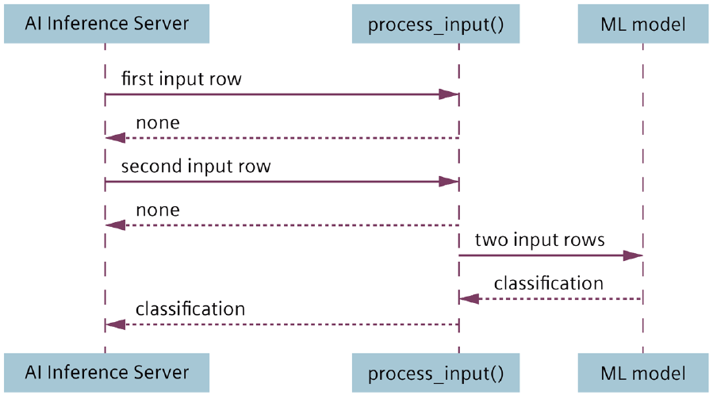

<!--
SPDX-FileCopyrightText: Copyright (C) 2020 - 2025 Siemens AG

SPDX-License-Identifier: MIT
-->

# How to process time series of signals

For time series use cases, the situation is typically as follows. You have several signals,
that you want to sample at a regular rate and you want to feed your ML model with a time
window of multiple samples at once. For example, your model might be designed to expect a
window of 5 samples for 3 variables.

|Time stamp |var1 |var2 |var3
|----|----|----|----
|9:50:23 |1.2 |202 | 25
|9:50:28 |1.3 |230 | 5
|9:50:33 |1.2 |244 | 18
|9:50:38 |1.2 |244 | 18
|9:50:43 |1.2 |244 |18

Ideally, each signal is a variable that is read by the Industrial Edge Databus, as configured in the AI Inference Server. Often, the signals from PLCs are captured using the Industrial Edge S7
Connector, which samples these signals from given PLC tags and makes them available on
the Databus.

Unfortunately, data points for the signals do not necessarily arrive at a regular rate or
synchronously. By default, your Python script is usually called with a single variable, and the
others are `None`. However, the ML model expects an entire matrix of multiple variables in an
entire time window.

|Time stamp |var1 |var2 |var3
|----|----|----|----
|9:50:28 |None |230 | None

To ensure the regular rate and the synchronicity of inputs, the AI Inference Server supports inter-signal alignment. You can specify a time interval and receive the inputs for all variables
stimulated in that interval. In our example, you specify 5 seconds as the time interval and
receive inputs such as:

|Time stamp |var1 |var2 |var3
|----|----|----|----
|9:50:28 |1.3 |230 | 5

As there is no guarantee that the data source will deliver a data point in each interval, there is
still a possibility that some values are missing and set to None in an input row. However, if
the sample rate of inter-signal alignment does not exceed the data rate of the sources, your
Python script will mostly provide complete rows of data.

For details of inter-signal alignment, refer to the [AI Inference Server user's manual](https://support.industry.siemens.com/cs/document/109825687/industrial-ai-ai-inference-server?dti=0&lc=en-WW).

Refer to the packaging notebook in the State Identifier project template and the AI SDK API
reference to specify inter-signal alignment to be applied to the input of an ML pipeline when
it is packaged for deployment to the AI Inference Server.

However, rows are not yet enough to feed time series ML models when they need data
windows consisting of multiple rows. Since the AI Inference Server does not support
accumulating windows, the Python script must take over this task. The key point of the
server's script interface here is that not all inputs in your Python script result in an output
because the ML model can only produce output if the received input has just completed a
data window that can be passed to the model to calculate an output.

As described in [returning processing result](06-return-processing-results.md) how to guide, the script can return `None` while it accumulates input and the model cannot calculate a value for the output. For reasons of compactness, the following diagram shows this for a window size of two.

This can be even more complex in real life depending on whether the windows are overlapping or not. For a concrete implementation of such accumulation logic, refer to the Python script provided in the State Identifier project template.

Note that you cannot use parallel component execution if your component relies on building up windows from subsequent data points, as the data points would be distributed to different instances of the component. You can, however, separate the aggregation of data windows and CPU-intensive processing of the windows into a component each and enable parallel execution for the latter only.

Even in this case, there is no guarantee that the processing of the windows finishes in the original sequence of the data. If that is essential, you should supply the windows with a sequence ID in the aggregating component that you pass on to the output of the processing component. That way the consumer of the pipeline can recreate the original sequence.

## Processing batch data

In batch use cases, such as the classification of discretely manufactured items, the input data is often available in a single packet on the Databus in a text representation such as a JSON structure or CSV table. For example, data is provided through External Databus as a textual payload. The Industrial Edge Vision Connector also delivers images embedded in a JSON through Databus.

Such data is treated as a single variable of type String, which is passed then to `process_input()` as a dictionary with a single element. You need to process this input string according to which representation it uses, for example, `json.loads()` for JSON or a
combination of `splitlines()` and `csv.reader()` for CSV.
For a concrete code example that shows how to process a single input variable with a JSON structure, refer to the [Image Classification tutorial](../e2e-tutorials/image_classification/README.md).
