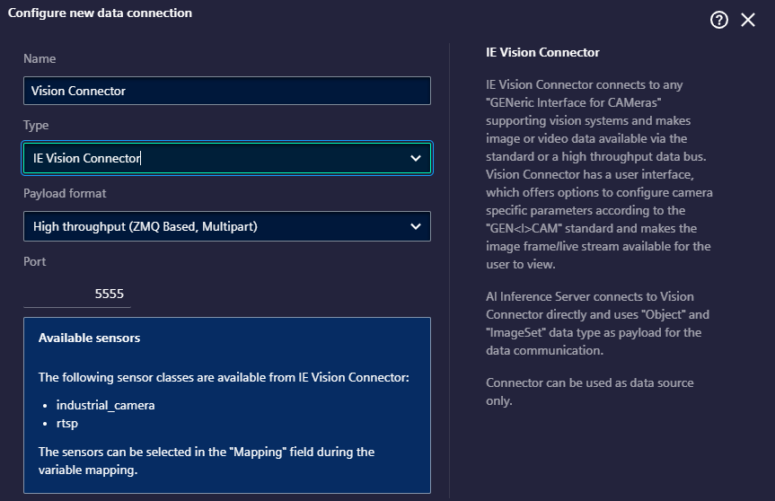

# How to process images

The preferred solution to receive images in your Inference Pipeline is to have an installed [Vision Connector](https://support.industry.siemens.com/cs/document/109963116/vision-connector?dti=0&lc=en-WW) and connected to cameras. Then the `Vision Connector` is capable to receive images from the cameras and provides them in 'ImageSet' format for AI Inference Server. This way the images can be received together with its metadata and in a standardized format.

To do so, your AI Inference Server must have a connector configured as shown below.




## Using `Vision Connector` with type `ImageSet`

This format of payload is designed to send the image in any format provided, extended with important metadata.

```json
{
    "version": "1", # version of the Metadata format
    "count": 1,     # Number of images on message
    "timestamp": "2024-06-18T13:00:37.189219",  # Camera acquisition time
    "detail": [     # list of images with detailed information
        {    
            "id": "camera-024581",              # unique image identifier. 
            "timestamp": "1718708437.189219",   # Timestamp provided by the camera
            "width": 600,                       # image width
            "height": 400,                      # image height
            "format": "BayerRG8",               # image format
            "metadata": "",                     # optional extra information on image
            "image": image_bytes                # bytes of images with the given 'format'
        }
    ]
}

```

As observed, the JSON format is capable of encapsulating a collection of images along with related metadata for both the payload and individual images.  
In this case, the `detail[0].image` field will be a one-dimensional byte array, regardless of whether it is in a monochrome or RGB format, which is defined in the `detail[0].format` field of the payload. When working with this payload in your pipeline, the first step is to convert the byte array to the format required by the model or the next step in the pipeline.

Vision use cases often involve GPU Runtime in the AI Inference Server. Therefore, our task is to produce a one-dimensional float array and pass it to the GPURuntime step. 

The following example demonstrates a solution using the OpenCV and Numpy libraries.
```python
# build_package.py
# assuming the first step in our Pipeline is 'preprocessing' 
# and we define the ImageSet input with the name 'vision_payload'

preprocessing.add_input('vision_payload', 'ImageSet')

[..]
```

```python
# entrypoint.py
# imports ..

WIDTH = HEIGHT = 224     # expected image size

# assuming the image arrives in the payload above with pixel format BayerRG8
def process_input(payload: dict):
    # extracting image details from the payload
    extracted = payload['vision_payload']
    image_detail = extracted["detail"][0]

    # extracting image metadata
    iuid = image_detail['id']
    width = image_detail.get("width", None)
    height = image_detail.get("height", None)

    if (width, height) != (WIDTH, HEIGHT):
        logger.warn("Image is dropped because of unexpected image size")
        return None

    # reading the byte-array into numpy array with one dimension, 
    image_data = numpy.frombuffer(image_detail['image'], dtype=numpy.uint8)  # BayerRG8, (height x , )
    
    # forming two-dimensional numpy array with dimensions width and height
    image_data = image_data.reshape(height, width)                           # BayerRG8, (height, width)
    
    # converting from BayerRG8 format to 3-dimensional RGB image
    image_data = cv2.cvtColor(image_data, cv2.COLOR_BayerRG2RGB)             # RGB, (height, width, 3)
    
    # normalizing into [0,1) range and converting to float32
    image_array = image_data.astype(numpy.float32) / 255.  # numpy.float32, (height, width, 3)

    # flattening the 3 dimensional array and adding to an empty batch
    inputs = numpy.array(image_array.ravel())   # numpy.float32, (height x width x 3, )

    return {
        'input': inputs    # assuming that our ML Model has an input with name 'input'
    }

```

<!-- from VCA user manual, section Accessing camera data via ZeroMQ -->
`Vision Connector` supports mainly the standardized GenICam pixel formats, as the most common `Mono8`, `RGB8` formats or `BayerXX8` formats to reduce network traffic while the color information is still recorded.
For different pixel format it is also recommended to use the GenICam naming convention as described in section 4.35 of the [GenICam_PFNC_2_4.pdf](https://www.emva.org/wp-content/uploads/GenICam_SFNC_v2_7.pdf​,) document.

### `ImageSet` as Output

As `ImageSet` is designed to be received from `Vision Connector`, this variable type is only allowed as input or between Pipeline steps, but not as output.  
In this case you need to follow and provide the payload format as described above.  
For more details, refer to the [Vision Connector User Guide](https://support.industry.siemens.com/cs/document/109963116/vision-connector?dti=0&lc=en-WW).

## Other formats

There are other options to use different payload formats to receive images from sources that do not support `ImageSet. We recommend a ZMQ connection to receive images, over which you can receive image information in `Binary` or `Object` format.  

A short description on their capabilities can be found in documents  
- [12-use-binary-format-for-images.md](12-use-binary-format-for-images.md),   
- [13-use-object-format-for-images.md](13-use-object-format-for-images.md)
- [14-use-string-format-for-images.md](14-use-string-format-for-images.md)
