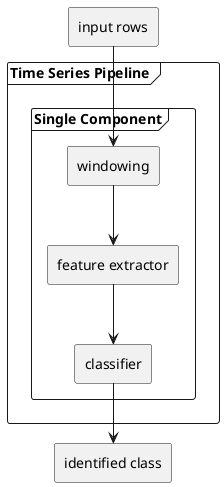
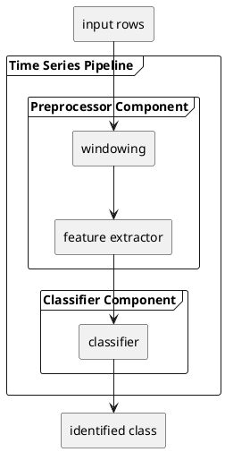

<!--
SPDX-FileCopyrightText: Copyright (C) 2020-2024 Siemens AG

SPDX-License-Identifier: MIT
-->

# How to package models into an inference pipeline

​The AI SDK provides the functionality to create an edge configuration package that wraps trained models. These models can be converted to
an edge configuration package using AI SDK and then uploaded and run on an AI Inference Server on an Industrial Edge Device.
The related features are in module `simaticai.deployment`.

From a deployment point of view, the inference pipeline might consist of one or multiple components. This is independent of the logical structure
of the inference pipeline. For example, a typical time series pipeline consisting of multiple scikit-learn pipeline elements can be packaged in
a single pipeline component for deployment:

Alternatively, you might deploy the same pipeline split into two components:

To keep things simple and less error-prone, you should normally deploy your inference pipeline using as few components as possible.
In many cases, a single component will be sufficient. However, there might be reasons why you might consider using separate components,
such as:

- You need a different Python environment for different parts of your processing, e.g. you have components requiring conflicting versions of packages.
- You want to exploit parallelism between components without implementing multithreading.
- You want to modularize and build your pipeline from a pool of component variants, which you can combine flexibly.

The AI SDK allows you to create pipeline components implemented in Python and composing linear pipelines of one or multiple of such components.
The API is designed to anticipate future possible types of components that might be based on a different technology than Python, e.g. ONNX or
native TensorFlow Serving. However, currently only Python is supported.

The workflow of creating an inference pipeline package is the following:

1. Write the Python code that wraps your trained model as an inference pipeline component.
2. Define the pipeline component.
3. Repeat the above if you have multiple components.
4. Configure the pipeline.
5. Export the pipeline configuration to an edge configuration package.

## Creating pipeline components implemented in Python

Implementing an inference pipeline component in Python is a comprehensive topic in itself and is described in full detail in the [How to define components](01-define-components.md) guide. Here, we will only provide an overview.

A component is made up files and metadata. Files include

- Python scripts and
- trained models.

Metadata includes

- component name, component version,
- required Python version and Python packages,
- input and output variables,
- the number of parallel executors and
- the entrypoint.

It is up to you how you lay out the files in the filesystem. We recommend you to follow the project templates for the AI SDK,
where source code and saved trained models are organized into a given structure. The idea is that you retain the same relative structure
on AI Inference Server, which allows you to use the same relative references from source code to saved models or other files.

Once the files for the component are all in place, which is usually at minimum a Python script for the entry point and the inference wrapper
and a saved model, you create the pipeline component by running a Python script or a notebook that

- creates a `PythonComponent` object with a given name, component version and required Python version,
- defines required Python packages,
- defines input and output variables,
- defines custom metrics,
- defines the number of parallel executors,
- adds Python scripts and saved models and last but not least
- defines the entry point among the Python scripts.

All this takes place with the corresponding functionality of the `simaticai.deployment`​ module. For concrete examples, see the packaging notebooks
in the project templates. For more information and advanced options, see the AI SDK API reference manual.

Please take into account the following limitations:

- The AI SDK allows you to choose a required Python version that is supported by different versions of AI Inference Server.
  Please make sure that you choose a Python version that is supported by the version installed on your target Industrial Edge device.
  At the time of writing, this is Python version 3.11.
- The required Python packages must be either a precompiled wheel for the target platform, or they can be in a pure Python source distribution format. The AI Inference server does not support compiling packages that contain sources in other languages like Rust or C++.
- You can add other Python repositories by putting the line `--extra-index-url=my.repo.example.com` into the requirements.txt and adding it to the component.
- The required Python packages must be either downloadable or must be present on the file system during the building of the edge configuration package. In the latter case they must be added to the component with `component.add_python_packages("path/to/example-1.0.whl")`.
- At the time of writing, there is a restriction that the entry point script must be in the root folder of the package. This requirement
  might be relaxed with later versions of AI Inference Server.
- AI Inference Server supports a maximum of 8 parallel executors.

## Configuring and saving the pipeline

​After you create the components, even if it is only a single one, you have to combine them into a pipeline using a `Pipeline` object.

If the pipeline has only a single component, the situation is easy, as the pipeline will have the same input and output variables
as its sole component. You only have to specify a pipeline name and version, from which the file name will be derived when you
save the package. Examples for this can be found near the end of the package creation notebooks in the project templates.

To build a linear pipeline from multiple components, you can still mostly rely on the constructor of `Pipeline`, which will
attempt to auto-wire the components passed as a list,

- connecting pipeline input to the first component,
- connecting inputs and outputs of subsequent components if the variable name matches and
- connecting the last component to the pipeline output.

Some components may require special variable types, e.g. the GPU component must receive its inputs in a specific format, and it will produce the output in a specific format too.
Please refer to [Guideline for writing runtime components](writing_components.md) for variable type handling.
In the general case, we recommend that you pass data from one component to the other in a single variable of type `String`, serializing and deserializing whatever data you have through a string.

The low-level methods of class `Pipeline` allow you to define arbitrary wiring between components and pipeline inputs and outputs
but the AI SDK cannot guarantee that the result will behave on AI Inference Server as intended.

Concerning pipeline input and output using different data types and defining custom metrics, please refer to the following guides:

- [How to define components](01-define-components.md)
- [How to use variable types](03-use-variable-types.md)
- [How to add custom metrics](07-add-custom-metrics.md)

which explains both how input and output data is passed between AI Inference Server and your entrypoint and explains special considerations
that apply for a continuous stream of time series data or for bulk data.

No matter if you created the pipeline with a single constructor call or using low-level methods, you have to export it as a last step.
This not only creates the edge configuration package as a zip file but also leaves the contents of the zip in the file system,
which you can explore to troubleshoot or to see how your package creation calls are reflected in the contents of files and directories.

Additional information about package versioning can be found in the [How to version packages](16-version-packages.md) guide.

## Best practices for packaging

Given AI Inference Server has certain limitation in place, there are a number of things to consider when creating inference pipelines.

### Package size

- Review all the references to assure that only valid references are added to the model.​
- Use a code analyzer to detect unused code and remove code parts that are not used.​
- Separate data acquisition, training, testing and model code into different files, and only include the model code in the pipeline.​
- Assure that all model functions are isolated to be able to create a clean entrypoint file.​

### Error proneness

- Use only relative paths to files inside the model.​
- Make sure that you only use packages that are matching the target platform, and (in case of source only packages) contain only Python code. Any other package might prevent the edge package to be executed on AI Inference Server.
