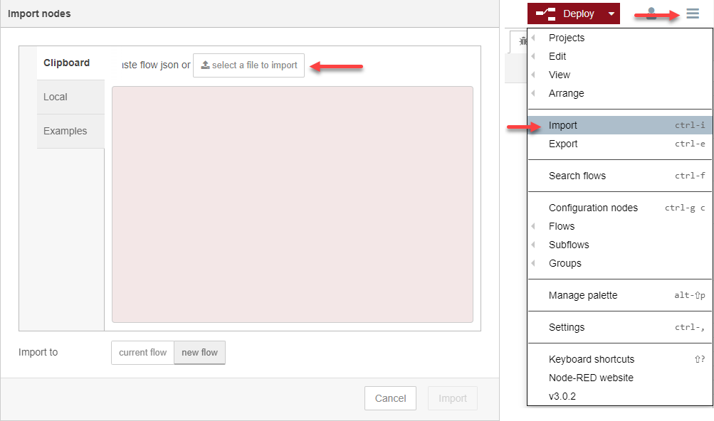
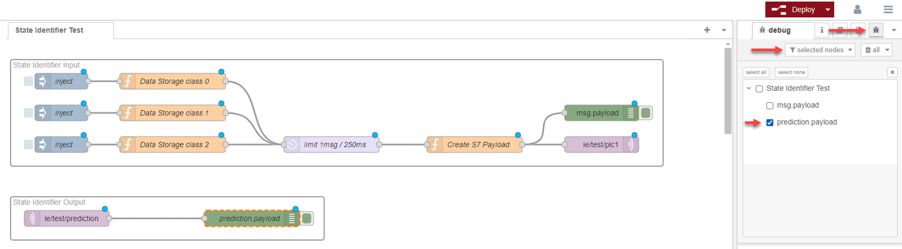
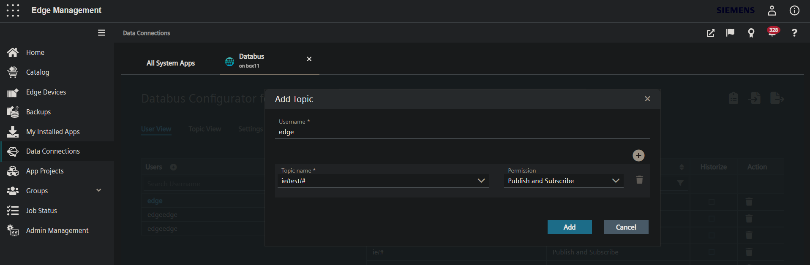
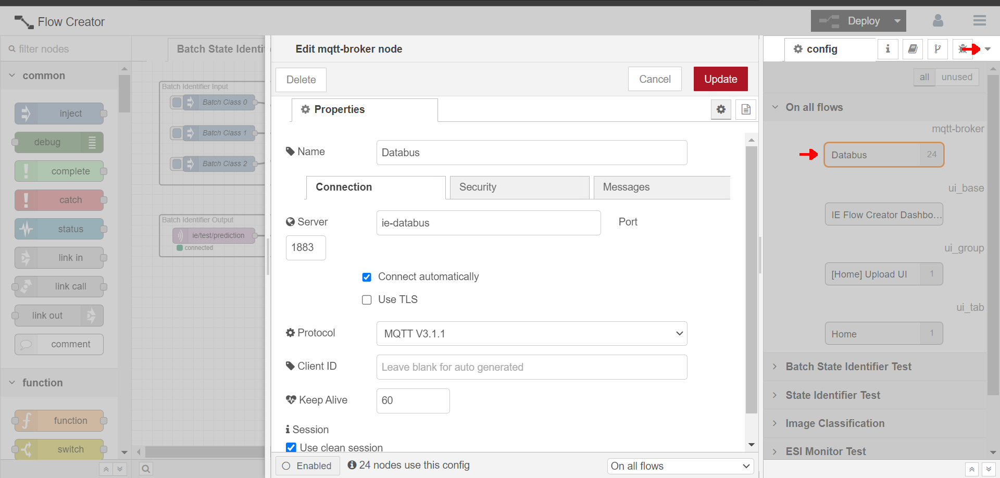

<!--
SPDX-FileCopyrightText: Copyright (C) 2020 - 2025 Siemens AG

SPDX-License-Identifier: MIT
-->

# How to test pipelines on an Edge Device

In this howto you learn how to test the edge configuration packages from AI SDK Tutorials on a real Industrial Edge device.<br/>
This howto assumes that you have access to an Industrial Edge device and to the corresponding Industrial Edge Management system.

## Prepare a pipeline and deploy it to AI Inference Server

1. We will use the edge configuration packages from the following tutorials:

   - Batch State Identifier
   - State Identifier

2. Create an edge configuration package with notebook `30-CreatePipelinePackage.ipynb` for all tutorials.

3. Import the edge configuration packages in AI Inference Server and create the necessary data connections and mappings so that the inputs and outputs of the pipelines are connected and mapped to the MQTT or ZMQ topics.

## About Flow Creator

Flow Creator is an application that allows you to create data processing pipelines with a drag and drop GUI. You can define nodes that can exchange messages with the Databus in MQTT format. There are function nodes, where you can write your own data transformer scripts. For example, a `function` node that can wrap the payload in the S7 Connector's message format.

## Import the test flows

Flow Creator's application menu is located in the top right corner, represented by the `☰` icon.
Select the `Import` option from the application menu. Click on the `select a file to import` button, and import the following JSON files.

- [Batch State Identifier Flow.json](../e2e-tutorials/batch_state_identifier/flows/Batch%20State%20Identifier%20Flow.json)
- [State Identifier Flow.json](../e2e-tutorials/state_identifier/flows/State%20Identifier%20Flow.json)

<div style="max-width: 70%; margin-left: auto; margin-right: auto;">
</div>

Set up the debug output by selecting and enabling the output debug nodes. Under the application menu, there is a down arrow `▼` icon, which can be used to switch between tabs. First click on the `Debug messages` tab, then click on the `Selected nodes` filter, and select the output nodes as displayed in the screenshot.

<div style="max-width: 70%; margin-left: auto; margin-right: auto;">
</div>

Flows can be individually enabled or disabled. Select the `information` tab, where you can disable the unused flows.<br/>
After the flows are imported and the desired one is enabled, you need to click on the `Deploy` button near the top right corner.

## Configure Databus access

In the Industrial Edge Management system, launch the `Data Connections` application for your Industrial Edge device, and create a user on the Databus for the testing topics. You can use a wildcard to allow access to multiple topics with the same prefix. Click on the add new topic button, and create a wildcard topic named `ie/test/#` for your user, and set the permissions to `publish and subscribe` as shown in the screenshot. Deploy the changed configuration to your Industrial Edge device.

<div style="max-width: 70%; margin-left: auto; margin-right: auto;">
</div>

The same username and password needs to be configured in the test flows. Select the `Configuration nodes` tab, then the `Databus` node. Here on the `Security` tab you can provide the credentials.

<div style="max-width: 70%; margin-left: auto; margin-right: auto;">
</div>

After the Databus access is configured, you need to click on the `Deploy` button near the top right corner.

## Testing the Batch State Identifier example

This edge configuration package uses the Databus connector. Data is provided in batch as JSON, and the results will be returned also in batch in JSON format.

### Input / Output mapping

|    Name    |  Type  |      Mapping       | Connection |
| :--------: | :----: | :----------------: | :--------: |
| json_data  | String |   ie/test/batch    |  Databus   |
| prediction | String | ie/test/prediction |  Databus   |

### Providing test data

In this flow the test data is provided by three `inject` nodes named `Batch Class [0-2]`
By double-clicking on any of the `inject` nodes, the property editor dialog shows up, where you can change the content of the `msg.payload` variable by clicking on the `…` icon. The data must be in the following JSON format.

```json
{
  "measeurement_start": "2019-02-08 08:48:56",
  "measeurement_end": "2019-02-08 08:50:11",
  "class": "0",
  "measurements": [
    {
      "ph1": 2831.4,
      "ph2": 2700.77,
      "ph3": 2723.44
    },
    {
      "ph1": 2825.4,
      "ph2": 2688.06,
      "ph3": 2708.36
    }
  ]
}
```

### Executing the test

First start the `Batch State Identifier` pipeline on the AI Inference server. Then in Flow Creator trigger any of the `inject` nodes to send the test data to the pipeline.

The output can be examined on the `Debug messages` tab.

## Testing the State Identifier example

This edge configuration package uses the Databus connector with the S7 payload format. The test data will be wrapped in the S7 format, which will be separated into individual variables on the AI Inference Server.

The returned value will also be in S7 format.

### Input / Output mapping

|    Name    |  Type   |          Mapping          |  Connection  |
| :--------: | :-----: | :-----------------------: | :----------: |
|    ph1     | Double  |     ie/test/plc1:ph1      | S7 Connector |
|    ph2     | Double  |     ie/test/plc1:ph2      | S7 Connector |
|    ph3     | Double  |     ie/test/plc1:ph3      | S7 Connector |
| prediction | Integer | ie/test/prediction:output | S7 Connector |

### Providing test data

In this test, the data is stored in `function` nodes called `Data Storage class [0-2]`. Double clicking a node, the internal script can be edited. The test data must be provided in the `data` variable in the following format:

```javascript
var data = [
  { ph1: 3039.28, ph2: 2948.89, ph3: 3135.12 },
  { ph1: 3010.98, ph2: 2921.01, ph3: 3109.07 },
];
```

These `function` nodes will send the data one line at a time.

### Executing the test

After the `State Identifier` example is deployed, mapped and running on AI Inference Server, click on the boxes on the left side of the `inject` nodes. This will trigger the `function` nodes to send the data through the flow. There is a `delay` node, where you can configure the message per seconds rate.

Results can be examined on the `Debug messages` tab.
