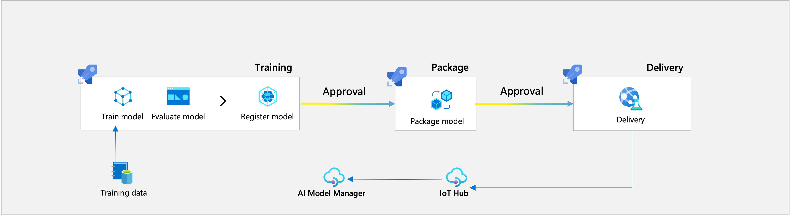

<!--
SPDX-FileCopyrightText: Copyright (C) 2020 - 2025 Siemens AG

SPDX-License-Identifier: MIT
-->

# How to use AI SDK in an Azure MLOps environment
AI SDK can be used in an Azure MLOps solution. With the required infrastructure in place, Azure MLOps pipelines can leverage AI SDK to create packages, which can be deployed to AI Inference Server using AI Model Manager connected to Azure.

For more details about Azure part, please read the [Azure Machine Learning documentation](https://learn.microsoft.com/en-us/azure/machine-learning).

## Setup Azure MLOps environment
Create an Azure Machine Learning Workspace with the necessary infrastructure.
Terraform can be used to describe the infrastructure and deploy it in a reproducible way.

## Setup Industrial AI applications
On the Industrial AI side, the following apps are required:
- [AI Inference Server](https://support.industry.siemens.com/cs/document/109814799/ai-inference-server): AI Inference Server is an Industrial Edge Application designed to execute Machine Learning Models in an Inferencing Pipeline.
- [AI Model Manager](https://support.industry.siemens.com/cs/document/109963118/ai-model-manager): AI Model Manager is designed to store Pipeline Packages built on the Machine Learning Models to be executed.
- [AI Model Monitor](https://support.industry.siemens.com/cs/document/109963117/industrial-ai-ai-model-monitor): AI Model Monitor is suitable for monitoring the Pipelines running on AI Inference Server.

Make sure the AI Inference Server instance shows up as a possible deployment target in AI Model Manager.

## Connecting AI Model Manager
The Azure Machine Learning Workspace and the AI Model Manager instance can communicate through an Azure IoT Hub.
After the IoT Hub is ready, a new device connection string has to be created for AI Model Manager.
Then a new workspace of type Azure can be created in AI Model Manager using the connection string and a certificate.

For more details and runnable example see [howto-notebooks/azure-mlops/10-ConnectModelManager.ipynb](../howto-notebooks/azure-mlops/10-ConnectModelManager.ipynb)

## Create MLOps pipelines
In the Azure Machine Learning Workspace pipelines automate the whole process of training, packaging, and deploying models.
It is recommended to use separate pipelines for each process, like the example below.

### Data Asset pipeline
A machine learning scenario needs training data. A data asset pipeline manages training data and provides a way to explore and study it.
Collected data can be used by the training pipeline.

### Training pipeline
With a data asset pipeline in place, a model can be created and trained, and if it performs well, it can be registered and saved in the model registry.
A saved model can serve as an input to the packaging pipeline.

### Packaging pipeline
The trained models need to be packaged so AI Inference Server can run them. A packaging pipeline takes a specified model and produces a zip file that can be deployed to an AI Inference Server instance with the help of AI Model Manager using a delivery pipeline.

### Delivery pipeline
When a pipeline package is ready, and AI Model Manager is accessible through IoT Hub, a delivery pipeline can upload and deploy selected packages.
