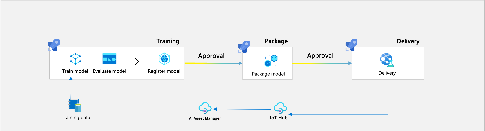
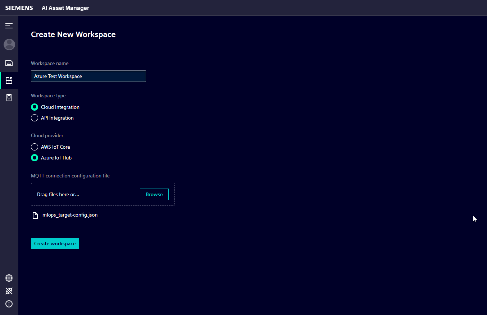

<!--
SPDX-FileCopyrightText: 2025 Siemens AG

SPDX-License-Identifier: MIT
-->

# How to use AI SDK in an Azure MLOps environment
AI SDK can be used in an Azure MLOps solution. With the required infrastructure in place, Azure MLOps pipelines can leverage AI SDK to create packages, which can be deployed to AI Inference Server using AI Asset Manager connected to Azure.



For more details about Azure part, please read the [Azure Machine Learning documentation](https://learn.microsoft.com/en-us/azure/machine-learning).

## Setup Azure MLOps environment
Create an Azure Machine Learning Workspace with the necessary infrastructure.
Terraform can be used to describe the infrastructure and deploy it in a reproducible way.

## Setup Industrial AI applications
On the Industrial AI side, the following apps are required:
- [AI Inference Server](https://support.industry.siemens.com/cs/document/109814799/ai-inference-server): AI Inference Server is an Industrial Edge Application designed to execute Machine Learning Models in an Inferencing Pipeline.
- [AI Asset Manager](https://support.industry.siemens.com/cs/document/109817876/delivery-release-ai-asset-manager) AI Asset Manager allows receiving AI models from different sources, standardizes model deployment and management, and enables supervision of model execution.

Make sure the AI Inference Server instance shows up as a possible deployment target in AI Asset Manager.

## Connecting AI Asset Manager
The Azure Machine Learning Workspace and the AI Asset Manager instance communicate through an Azure IoT Hub.
This section describes a complete setup flow to create the IoT-side credentials and configure the Cloud Integration workspace in AI Asset Manager.
As you will work with sensitive information, you should store your keys generated by the upcoming scripts in a safe way.

### Goal
By the end of this setup, you will be able to:
- create an IoT Hub device identity for AI Asset Manager
- generate self-signed X.509 credentials for that device
- create the MQTT configuration file for AI Asset Manager
- create a Microsoft Azure Cloud Integration workspace in AI Asset Manager

### Prerequisites
- Azure subscription with permission to create an IoT Hub and devices
- AI Asset Manager running on your Industrial Edge environment
- `openssl` available on your local machine
- Python 3 environment

Because this process handles private keys and certificates, execute it on a trusted local machine and store generated files in a protected location.

### Create an IoT Hub
**&#9757; Manual step!**  
As the _manual steps_ on page [Create an IoT hub](https://learn.microsoft.com/en-us/azure/iot-hub/iot-hub-create-through-portal) are explained in depth, we only focus on how to use the certificates and keys for successful communication.  
Please, create the IoT Hub using the [creation form](https://portal.azure.com/#create/Microsoft.IotHub) after logging in with your Azure user.

Here you need to choose 
- one of your 'Subscription's, 
- an existing 'Resource Group', or creating a new one, 
- the 'Region' where your resources will be registered, 
- and an 'IoT hub name' of your choice.  

You can leave the other settings on default.

Once the IoT Hub is created, you will have its name, which will be needed later in this notebook, so set the `iot_hub_name` variable.  
Based on the name a hostname and a username will also be connected to your IoT Hub which will be used in this example, as well.  
Please find your hostname on `Properties` page of your Iot Hub as `Host name` and set the `iot_host_name` variable below.

```python
iot_hub_name = "<iot_hub_name>"
iot_host_name = "<iot_host_name>"
```

### CA Certificates for IoT Hub

Once the IoT Hub is created, it has a certificate chain that is used to encrypt the communication channel. AI Asset Manager needs to verificate the server's certificate chain, thus it needs its root certificate authority. The certificate authority can differ for the different regions.  
In our example `DigiCert Global Root G2` will be used, but in case of Azure China `DigiCert Global Root CA` should be used. 

For further details of certificate authorities see [DigiCert](https://www.digicert.com/kb/digicert-root-certificates.htm) page. The code cell below uses this page to download the `DigiCert Global Root G2` certificate file.  
To store certificates and keys in one place, you need to define
- `certificates_path`, which should be a path of your choice.  
    We suggest to store your certificates and private keys in a hidden folder of your _'Home'_ directory on your local computer.  
    To do so it is also recommended to execute this notebook locally.

```python
certificates_path = Path.home() / ".certificates"  # to store your security keys separately, you should define a safe path in your HOME directory

if not certificates_path.is_dir():
    certificates_path.mkdir(parents=True, exist_ok=True)
    os.chmod(certificates_path, stat.S_IRWXU)  # to make the folder safe, change its access rights

os.chdir(certificates_path)
```

### 3. Download root CA certificate for IoT Hub TLS

```python
root_ca_cert_path = certificates_path / "DigiCertGlobalRootG2.crt.pem"
urllib.request.urlretrieve("https://cacerts.digicert.com/DigiCertGlobalRootG2.crt.pem", root_ca_cert_path)
```

Reference: [DigiCert root certificates](https://www.digicert.com/kb/digicert-root-certificates.htm)

### 4. Create device credentials
In our example, for the sake of simplicity we are using Self Signed Certificates in the communication of AI Asset Manager and the IoT Hub.

AI Asset Manager will use device credentials to identify itself in Azure, and we will create them below.  
The certificates and keys will be created in the previously defined folder `certificates_path`.

For key creation you need to define
- `device_id`,  
    which the name of the device you need to add to your IoT Hub later
- `crt_subj`,  
    which is the subject of the certificate and the device id as _Common Name (CN)_.  
    The other fields of the subject are based on your location (e.g. '/C=IE/S=Dublin/L=Dublin 4/O=Company Ltd./OU=R&D/CN=ic_target_device').  
    A detailed description about used credentials can be found on the [Certificate requirements](https://learn.microsoft.com/en-us/azure/databox-online/azure-stack-edge-gpu-certificate-requirements) Azure pages.

```python
device_id = "ic_target_device"
device_crt_subject = f"/CN={device_id}"
```

The following path variables are compiled from the `device_id` and contain the path of the `private key`, the `self-signed device certificate`, and the `fingerprint of the certificate`, respectively.

```python
key_file_path = certificates_path / f"{device_id}.key"
cert_file_path = certificates_path / f"{device_id}.cert.pem"
thumb_file_path = certificates_path / f"{device_id}.thumb.txt"
```

Now you can create the certificate and private key files with one `openssl` command.  
In order the command to work, `openssl` must be installed and added to the system PATH.

```python
os.system(f"openssl req -x509 -sha256 -nodes -newkey rsa:4096 -keyout {key_file_path} -days 730 -out {cert_file_path} -subj '{device_crt_subject}'")
```

Then let's calculate the fingerprint of the certificate.

```python
os.system(f"openssl x509 -in {cert_file_path} -noout -fingerprint -sha256 -inform pem > {thumb_file_path}")
fingerprint = open(thumb_file_path).readline()
print("device_id:", device_id)
print("thumbprint:", fingerprint.split("=")[1].replace(":",""))
```

### 5. Add IoT Hub device (manual)
Now you can add your device _manually_ to your IoT Hub by choosing `Devices` menu item and clicking on the `Add` button on the top.  
On the form you need to add 
- `Device ID`,
    which is same as defined above as `device_id`
- `Authentication type` as `X.509 Self-Signed`  
    because we created a self-signed certificate above
- `Primary and Secondary Thumbprint`  
    which is calculated above

### 6. Create MQTT config file for AI Asset Manager

To enable the connection between the created IoT Device and AI Asset Manager, you need a configuration file which contains security properties for the device.  
This configuration file is compiled the code box below.

```python
device_crt = open(cert_file_path).read()
device_key = open(key_file_path).read()
root_ca_content = "\n".join(open(root_ca_cert_path).readlines())

endpoint = f'wss://{iot_host_name}:443/$iothub/websocket'  # using WebSocket
# endpoint = f'tls://{iot_host_name}:8883'  # using TCP over TLS

mqtt_config = {
    'ca_cert': root_ca_content,
    'x509_certificate': device_crt,
    'x509_private_key': device_key,
    'endpoint': endpoint,
    'topic_prefix': f'devices/{device_id}',
    'username': f'{iot_host_name}/{device_id}/?api-version=2021-04-12',
    'client_id': device_id
}
```

In this step we save the `credential` dictionary as json in the `certificates_path` directory as `mqtt-config.json`.  
When you are about to create a workspace for Azure in AI Asset Manager, you have to upload this file.

```python
import json
with open(certificates_path / f"{device_id}-config.json", "w") as conf:
    json.dump(mqtt_config, conf, indent=4)
```

### 7. Define Azure workspace in AI Asset Manager (manual)
 
Before you go further in this notebook, you should wait until your device_id appears in the list on the IoT Hub management page under the `Devices` menu.

Here we create an Azure workspace in your AI Asset Manager running on your Edge Device, and connect it to your previously created device by the compiled `mqtt-config.json` file.

The steps have to be taken:
1. Open `Workspace area` and click on the `Create new workspace` button
2. ​Enter the name of your new workspace
3. ​Choose the workspace type `Cloud Integration`
4. ​Choose the Cloud system `Microsoft Azure`
5. ​Choose the Integration type `IoT Hub`
6. ​Upload the MQTT connection configuration file (created above)
7. ​Click on the `Create workspace` button



Once the workspace is created in AI Asset Manager, a couple of messages should appear on the `Overview` page of your IoT Hub.

## Create MLOps pipelines
In the Azure Machine Learning Workspace pipelines automate the whole process of training, packaging, and deploying models.
It is recommended to use separate pipelines for each process, like the example below.

### Data Asset pipeline
A machine learning scenario needs training data. A data asset pipeline manages training data and provides a way to explore and study it.
Collected data can be used by the training pipeline.

### Training pipeline
With a data asset pipeline in place, a model can be created and trained, and if it performs well, it can be registered and saved in the model registry.
A saved model can serve as an input to the packaging pipeline.

### Packaging pipeline
The trained models need to be packaged so AI Inference Server can run them. A packaging pipeline takes a specified model and produces a zip file that can be deployed to an AI Inference Server instance with the help of AI Asset Manager using a delivery pipeline.

### Delivery pipeline
When a pipeline package is ready, and AI Asset Manager is accessible through IoT Hub, a delivery pipeline can upload and deploy selected packages.
