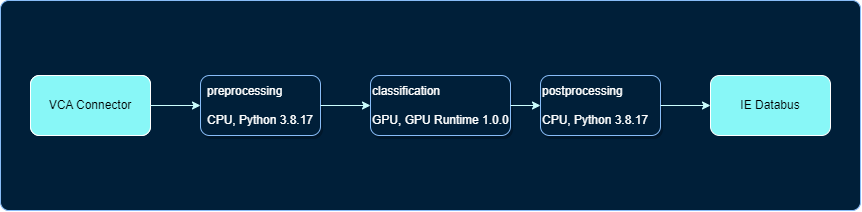
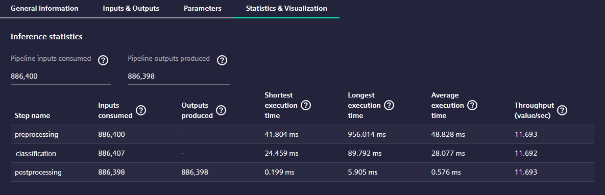
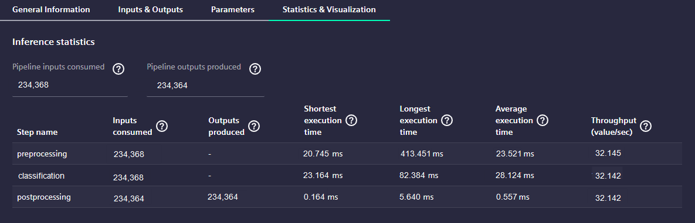
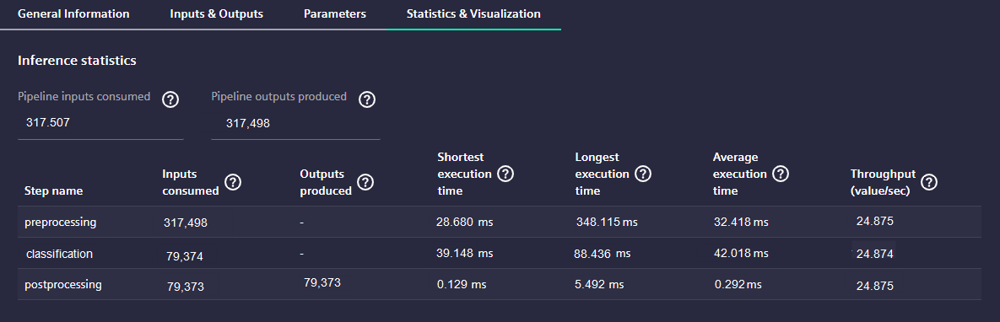

<!--
SPDX-FileCopyrightText: Copyright (C) 2020 - 2024 Siemens AG

SPDX-License-Identifier: MIT
-->

# Parallel Execution and Batch Processing

AI Inference Server provides various options to optimize data processing for Machine Learning Models, particularly when the Pipeline consists of multiple steps. In some cases, one step may execute faster than another, in which case it may be beneficial to run multiple instances of the slower step in parallel or processing batch of data instead of single ones. This can significantly improve the overall performance of the pipeline.


## A Visual Use Case example

Let's consider a scenario where we have 4 cameras producing a total of 100 images per second, with each camera generating 25 images per second. These cameras capture images of workpieces on a conveyor belt, and our goal is to quickly identify workpieces with damages. To achieve this, we create a Pipeline that incorporates an Image Classification model.


<p align='center'>3-Step Pipeline for Image Classification</p>

The diagram above illustrates a 3-step pipeline for the use case. The first step, 'preprocessing', receives the input payload and converts the 'ImageSet' into a 3-channel byte array format required by the model in the second step, 'classification'. The 'classification' step executes the model and performs inference on the image, resulting in image classification. Finally, the third step, 'postprocessing', processes the classification results and provides a prediction that can be used for further decision-making.

The execution times of the three steps in the pipeline are typically different, as demonstrated by the following statistics.


<p align='center'>Execution times with the original pipeline</p>

By analyzing these statistics, it becomes evident that the overall throughput of the pipeline is determined by the execution time of the slowest step, which has an average duration of 48.828ms. In other words, the maximum throughput of the pipeline is approximately 1 / 48 ms, resulting in a rate of 20 frames per second.

To achieve high throughput in processing a large number of images, we can utilize parallel execution and batch processing techniques. 

To process this volume of images efficiently, we have two options:

1. [Parallel Execution](#parallel-execution): We can configure the preprocessing step to be executed in parallel. By allowing multiple instances of the preprocessing step to run simultaneously, we can receive incoming data from one instance while another instance processes the previous data. This enables the classification step to process the parallel inputs from preprocessing, resulting in a higher throughput for the entire pipeline.

2. [Batch Processing](#batch-processing): Another approach is to optimize the performance of the classification step by processing multiple images in a batch instead of one at a time. For example, if our classification model takes 28ms to process one image, but only 40ms to process 4 images in a batch, it is more efficient to process 4 images together. This allows us to achieve a higher throughput for the classification step.

It is important to note that collecting a batch of images in the preprocessing step may take longer than processing a single image. However, by combining parallel execution and batch processing, we can effectively handle the high volume of images and achieve the desired throughput.

## Parallel Execution

To enhance the overall performance of the pipeline, we can enable parallel execution for the 'preprocessing' step. By allowing multiple instances of the 'preprocessing' step to run concurrently, one instance can handle incoming data while another instance processes the previous data. This enables the 'classification' step to process the parallel inputs from 'preprocessing', resulting in a higher throughput for the entire pipeline.

To configure step 'preprocessing' for parallel execution, you can use the following code:

```python
preprocessing.set_parallel_steps(2)
```

Once the step is configured to run in parallel, on the UI of AI Inference Server, the number of the step instances can be modified.

By configuring the 'preprocessing' step with the provided code, the step is able to process twice the amount of images compared to before. This makes the 'classification' step the slowest step and the bottleneck of the pipeline.  


<p align='center'>Execution times running reprocessing step in 2 instances</p>

With an execution time of 28 ms for the 'classification' step, the pipeline can process an average of 35 images per second. However, this is still far from the desired throughput of 100 images per second. To achieve this goal, we can utilize batch processing as another optimization technique.

## Batch processing

To optimize the performance of the 'classification' step, it is advantageous to process multiple images simultaneously instead of sequentially. For instance, if we have a classification model that takes 28ms to process one image, but only 40ms to process 4 images in a batch, it is more efficient to process 4 images together.


<p align='center'>Execution times running classification step for 4 images together</p>

This approach still makes the 'classification' step the bottleneck, but now it can process 4 x 1 / 40ms, which is 100 images per second.

However, it is important to note that collecting these 4 images in the preprocessing step may take 4 times longer than processing a single image.

To address this, we can utilize parallel execution as described earlier.

### Configuring batch processing

Once you have a model which is created for processing batch of images, you can use it in your GPURuntime Component, as usually by creating the appropriate Component and adding the model:

```python
# creating the component
classification = GPURuntimeComponent(name='classification')

# adding the model
classification.use_model( model_dir / "model.onnx",
                          max_batch_size = 4, 
                          warmup = model_config.Warmup.RANDOM_DATA )
```

The code works with a model which is created with dynamic input shape, and able to handle 4 images at once. That can be checked via `onnx` library:

```python
# loading the model
model = onnx.load( model_dir / "model.onnx")

# printing the info of the model input layer
print(model.graph.input)  
```
The output looks like below and the first dimension of the input layer shows the `batch size` the model is prepared for.  

```protobuf
[name: "input"
type {
  tensor_type {
    elem_type: 1  # datatype of the layer FP32
    shape {
      dim {
        dim_value: -1  # -1 means dynamic batch size
      }
      dim {
        dim_value: 3  # number of color channels
      }
      dim {
        dim_value: 224  # height of the image
      }
      dim {
        dim_value: 224  # width of the image
      }
    }
  }
}
]
```

The first dimension in this case means the `batch size` is dynamic, as it is set to `-1`. In case this dimension is a positive integer, the model is created for fix amount of images. In case the first dimension does not have `dim_value`, most probably that is also capable to process dynamic size of images, so you must define its `dim_value` the way shown below.

```python
model.graph.input[0].type.tensor_type.shape.dim[0].dim_value = -1
```

When the model is trained for a fixed batch size, you should add your model with `max_batch_size` set to `0`.

```python
# adding the model
classification.use_model( model_dir / "model.onnx",
                          max_batch_size = 0, 
                          warmup = model_config.Warmup.RANDOM_DATA )
```

## Conclusion

We have explored two optimization techniques to improve the performance of a pipeline with multiple steps: parallel execution and batch processing.

To effectively utilize these techniques, it is important to measure the execution times of each step using AI Inference Server or AI Model Monitor. This will help identify the slowest step and determine the potential for improvement.

For parallel execution, the preprocessing step can be configured to run multiple instances concurrently. By allowing one instance to handle incoming data while another instance processes the previous data, the classification step can process parallel inputs from preprocessing, resulting in a higher overall throughput.

Batch processing involves processing multiple images simultaneously instead of sequentially. This can be achieved by creating a model that is capable of handling a batch of images. By processing multiple images together, the classification step can achieve higher throughput. However, it is important to note that collecting a batch of images in the preprocessing step may take longer than processing a single image.

To implement batch processing, the model must be created with dynamic input shape, allowing for a variable batch size. The batch size can be specified as a negative value (-1) to indicate dynamic sizing. If the model is trained for a fixed batch size, the max_batch_size parameter should be set to 0 when adding the model to the GPURuntime Component.

In conclusion, to optimize the performance of a pipeline with multiple steps, it is crucial to measure execution times, configure steps for parallel execution, have a deep understanding of the ML model, and leverage the tools provided by AI Inference Server and AI SDK.
